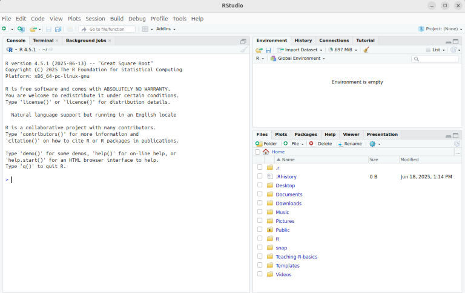

# Installation Instructions

## Getting Help

If you encounter problems and googling / chatGPTing does not help you can:

- write us on the [slack channel](https://crc1678-inf.slack.com/archives/C090Z8C91M2) or on our email [crc1678-inf@uni-koeln.de](mailto:crc1678-inf@uni-koeln.de)
- [open an issue](https://github.com/CRC-1678/Teaching-R-basics/issues/new/choose) in this repository
- search on R-specific resources: [R-bloggers](https://www.r-bloggers.com/) and [Posit community](https://forum.posit.co/)

## Terminal

In Windows, you can use the built-in Command Prompt or PowerShell. Open the Start menu, type "cmd" or "PowerShell", and press Enter.

In macOS, you can use the Terminal application. Open Spotlight (Cmd + Space), type "Terminal", and press Enter.

In Linux, you can use the terminal emulator that comes with your distribution. You can usually find it in the applications menu or by pressing Ctrl + Alt + T.

## Git

Git is the version control system which is central to modern code development. Git allows you to track and record any changes in your code. [GitHub](https://github.com/) is a popular git hosting and development platform which allows you to share the code with others, collaboratively develop it, test, run and deploy. If you publish your analysis, it will be mandatory for you to provide the code and most likely you will use GitHub for that. Another popular platform, especially in academia, is [GitLab](https://gitlab.com/) - your organization may already provide an institutional account for it.

**Check if you have git installed**
1. Open a terminal.
2. Type the following command and press Enter:
   ```bash
   git --version
   ```
3. If Git is installed, you will see the version number. If not, you will need to install it as described below.

### Install Git

**Windows**

1. Download the Git installer from the [official Git website](https://git-scm.com/download/win).
2. Run the installer and follow the instructions.

**macOS**

1. Open a terminal.
2. Install Homebrew if you haven't already by running:
   ```bash
   /bin/bash -c "$(curl -fsSL https://raw.githubusercontent.com/Homebrew/install/HEAD/install.sh)"
   ```
3. Install Git using Homebrew:
   ```bash
   brew install git
   ```

**Linux**

1. Open a terminal.
2. Use your package manager to install Git. For example, on Debian/Ubuntu:
   ```bash
   sudo apt update
   sudo apt install git
   ```


### GitHub

If you don't have a GitHub account, create one at https://github.com.

*Optional: GitHub Desktop:* If you prefer a graphical interface for Git, you can install [GitHub Desktop](https://desktop.github.com/).

### Configure Git

After installing Git, you need to configure it with your name and email address. Open a terminal and run the following commands, replacing `Your Name` and `you@example.com` with your actual name and email address:
```bash
git config --global user.name "Your Name"
git config --global user.email "you@example.com"
```

### Clone the course repository

1. Open a terminal.
2. Navigate to the path where you want to clone the repository.
3. Use the following command to clone the repository: 
```bash
git clone https://github.com/CRC-1678/Teaching-R-basics.git
```

It will download the contents of this repository into a Teaching-R-basics folder.

## R

### Check if you have R installed

#### Linux and macOS

1. Open a terminal.
2. Type the following command and press Enter:
   ```bash
   R --version
   ```
3. If R is installed, you will see the version number. If not, you will need to install it as described below.

Note: on linux, you may see a hint saying:
```
Command 'R' not found, but can be installed with:
sudo apt install r-base-core
```
It is not recommended to install r-base-core via apt because the R version is not up-to-date. Follow instructions below to install R from the CRAN repository.

#### Windows

Press the "Windows" key, type "R", and press Enter. If R is installed, the R console will open and display the version number. If not, you will need to install it as described below.

### Install R

Install R from the [CRAN website](https://cran.r-project.org/). 

#### Windows

Go to "Download R for Windows" -> "base" -> "Download R x.x.x for Windows" (where x.x.x is the latest version, in our case 4.5.0). Run the installer and follow th instructions.

#### macOS

Go to "Download R for macOS" -> "R-4.x.x.pkg" (where x.x.x is the latest version, in our case 4.5.0). Run the installer and follow the instructions.

#### Linux

Go to "Download R for Linux" and follow the instructions for your specific distribution. For example, for Ubuntu/Debian:
1. Open a terminal.
2. Add the CRAN repository and install R:
   ```bash
   # update indices
   sudo apt update
   # make sure helper packages are installed:
   sudo apt install --no-install-recommends software-properties-common dirmngr
   # add the signing key (by Michael Rutter) for these repos
   wget -qO- https://cloud.r-project.org/bin/linux/ubuntu/marutter_pubkey.asc | sudo tee -a /etc/apt/trusted.gpg.d/cran_ubuntu_key.asc
   # Optional: to verify key, run gpg --show-keys /etc/apt/trusted.gpg.d/cran_ubuntu_key.asc 
   # Fingerprint will be: E298A3A825C0D65DFD57CBB651716619E084DAB9
   # add the repo from CRAN -- lsb_release adjusts to 'noble' or 'jammy' or ... as needed
   sudo add-apt-repository "deb https://cloud.r-project.org/bin/linux/ubuntu $(lsb_release -cs)-cran40/"
   # You will need to press [Enter] to finish
   # install R itself
   sudo apt install --no-install-recommends r-base
   ```

Check your R version after install - it should be `4.5.1` or higher.

### Install Rstudio

RStudio is an integrated development environment (IDE) for R that provides a user-friendly interface and is being maintained by the [Posit](https://posit.co/) company.

Go to the [RStudio download page](https://posit.co/download/rstudio-desktop/) and download the installer for your operating system.

#### Windows

Run the installer (for example, `RStudio-2025.05.1-513.exe`) and follow the instructions.

#### macOS

Run the installer (for example, `RStudio-2025.05.1-513.dmg`) and follow the instructions.

#### Linux
1. Open a terminal.
2. Download the latest RStudio .deb package, for example `rstudio-2025.05.1-513-amd64.deb`.
3. Enter the directory with the downloaded .deb (such as `Downloads`) and install the RStudio:
   ```bash
   sudo apt install ./rstudio-*.deb
   ```
*Note:* if you get the error `E: unmet dependencies.` or similar, try `sudo apt --fix-broken-install` as suggested. It may happen if you follow the instructions on Posit website and use `dpkg` instead of `apt`.

You can delete the downloaded .deb file now.

Open RStudio by searching for it in your system's app menu and clicking on the logo. You should see a default screen similar to this:



On the left you see the R console with a greeting message which also shows you your R version and suggests some first commands. You will use the console to type R commands. On the bottom right you see your files and directories. You can click on the "Teaching-R-basics" folder to navigate to the course materials. 

### Install R packages

R packages are collections of R functions, data, and documentation that extend the functionality of R. 

*CRAN*

R packages come from several sources. Most stable and reliable source is CRAN (Comprehensive R Archive Network), which provides the R itself. Basic command to install an R package from CRAN is `install.packages("package_name")`.

Go to RStudio and type in the R console the command to install the `tidyverse` package, which we will use in this course:

```R
install.packages("tidyverse")
```
If install was successful, you should see something like:
```
** testing if installed package can be loaded from final location
** testing if installed package keeps a record of temporary installation path
* DONE (tidyverse)
```

If you see an error message, check the [Note on system dependencies](#note-on-system-dependencies) below.

You can verify that the package was installed by opening the "Packages" tab in the bottom right pane of RStudio. You should see `tidyverse` in the list of installed packages. 

*Bioconductor*

Bioconductor is a repository of R packages for bioinformatics and computational biology. To install Bioconductor packages, you first need to install the BiocManager package and then use it to install other packages. More info on the [Bioconductor website](https://www.bioconductor.org/install/).

*GitHub*

Many packages are available only on GitHub, especially those that are in development. There are several ways to install a package from GitHub, for example, you can use `remotes` or `pak` package which contain commands to install from GitHub.

**Note on system dependencies**

Sometimes (especially on Linux and macOS) you will try to install a package with the above command and get a message `installation of package '...' had non-zero exit status`. This message means that your package failed to install. Often this lies in missing dependencies on your host system outside of R. You can solve this by scrolling your log in the R console looking for something like `ERROR: dependency '...' is not available for package '...'` or `ERROR: failed to compile ...`. Then you need to install the missing dependency on your system (not in R) using your package manager (e.g., `apt` on Debian/Ubuntu, `brew` on macOS, or `yum` on CentOS).

One way to reduce this problem is to use `pak` package's function to calculate system requirements before installing a package, for example for tidyverse on ubuntu, run:
```R
pak::pkg_sysreqs("tidyverse", sysreqs_platform="ubuntu")
```

You will get a list of packages tidyverse depends on and their system dependencies, as well as a command to install them on your platform, for example:
```
apt-get -y install libx11-dev libcurl4-openssl-dev ..... [etc]
```

Alternatively, you can use an online tool - Posit's [Package Manager](https://packagemanager.posit.co/client/#/) to find system dependencies of a package. 


### Upgrading

You will need to upgrade R and RStudio on a regular basis to be able to use newer packages and get latest developments and fixes.

**R**

*Windows and macOS*

Download the latest version of R from the [CRAN website](https://cran.r-project.org/) and install it as described above.

*Linux*

Use your package manager to update R. For example, on Debian/Ubuntu:
```bash
sudo apt update
sudo apt upgrade r-base
```

**RStudio**

Go to Help -> Check for Updates in RStudio. If there is a new version available, follow the instructions to download and install it.

**R packages**

To update all installed R packages, you can use the following command in the R console:
```R
update.packages(ask = FALSE)
```

### Uninstalling

This project sets up a learning environment locally, but you may decide to switch to a different setup, be it conda or a containerized environment or the RStudio server provided on your HPC cluster. In this case, you may want to uninstall the software you installed on your local laptop.

**R and RStudio**

*Windows and macOS*

Follow usual uninstall procedure for your operating system. On Windows, you can do it via "Add or remove programs" in the Settings. On macOS, you can drag the R and RStudio applications to the Trash.

*Linux*

1. Open a terminal.
2. Use your package manager to remove R and RStudio. For example, on Debian/Ubuntu:
   ```bash
   sudo apt remove --purge r-base rstudio
   sudo apt autoremove
   ```

**R packages**

To uninstall a single R package, type the R console:
```R
remove.packages("package_name")
```

