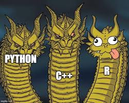

## **Credits**

-   Yashna for co-working on many aspects
-   CECAD core facility and Jan Großbach for sharing their materials
-   Julian for providing reasons not to use R
-   GitHub Copilot for helping with the exercises



## Code of Conduct

-   Treat everyone with dignity

-   Respect different learning pace

-   Share your code

-   Credit authors of the code you use

-   There are no stupid questions!

-   Use AI but check their answers 🤖

-   Help each other 😇

## Why R (and why not)?

😊

-   Good packages for statistical analysis

-   Advanced and interactive graphics

-   Open source and free

-   Biology-oriented packages in Bioconductor

😰

-   Conflicts between versions

-   Relatively slow

-   Relatively memory-hungry

## Getting help

**From us**

-   slack channel [#learning-r-beginners-2025](https://crc1678-inf.slack.com/archives/C090Z8C91M2)

-   [crc1678-inf\@uni-koeln.de](mailto:crc1678-inf@uni-koeln.de)

-   [open an issue](https://github.com/CRC-1678/Teaching-R-basics/issues/new/choose) in the GitHub repository of this course

-   [book a Zoom consultation](https://doodle.com/bp/crc1678/crc1678inf-introductory-meeting)

**For R**

-   Use `?` or `help()` inside R

-   ask on R-specific resources: [R-bloggers](https://www.r-bloggers.com/), [Posit community](https://forum.posit.co/)

## Set up

::: panel-tabset
### Set up

You should have already:

-   R+RStudio installed
-   necessary packages installed: `tidyverse`
-   Git repository cloned: <https://github.com/CRC-1678/Teaching-R-basics>

### RStudio projects

Projects in RStudio make your work shareable and reproducible.

-   Code and data in organized directory

``` r
# does not work on your friend's machine
data_file <- "C:/Users/svetlana/Documents/R/Teaching-R-basics/counts.txt"
# use relative path (or a package "here") - works on all machines
data_file <- "data/data.csv"
```

-   Project-specific settings in `.Rproj` file

-   Version control (Git)
:::

::: notes
Ask if they have question on setup.\
Switch to live and show how to click on .Rproj file.
:::

## Live coding

-   Open RStudio, navigate to Teaching-R-basics project
-   Open `Exercise-R-basics.Rmd` - we will go through it together
-   If you know the basics but still wish to practice: `Exercise-R-errors.Rmd` - work on your own - we will provide solutions in the end
-   If you wish to practice `tidyverse`: `DataManipulationAndVisualization.Rmd` - work on your own - we will go through it in the end if we have time

::: notes
Show them Rproj options quickly by clicking on the Rproj file again.
:::

## R startup

Full guide to R startup configuration at [Posit](https://docs.posit.co/ide/user/ide/guide/environments/r/managing-r.html).

`.Rprofile` and `.Renviron` are executed at the start of R session.

-   `.Renviron`: set environment variables. Structure: `KEY=VALUE` (one per line).

``` bash
GITHUB_PAT=your_github_token_here
```

-   `.Rprofile`: set options. Structure: R code. Example: load packages, provide custom functions, change your R prompt.

``` r
options(prompt = "R> ")
```

## R environment setup {.custom-small}

| Setup | Pros | Cons |
|----|----|----|
| local installation (what we did) | stable, fast, offline | "user" vs "system" package (Linux), limited resources |
| your institution's rserver on the cluster | large resources | no control over set-up |
| `renv` [package](https://rstudio.github.io/renv/) | record and share all packages in project | can get very slow for large projects |
| `conda` environment (use [pixi](https://pixi.sh/v0.24.1/ide_integration/r_studio/)) | simple set up | not all R packages available |
| container ( e.g. [rocker](https://rocker-project.org/images/) images) | full control, reproducible, portable | needs admin rights, rebuild to update |
| cloud ([Posit cloud](https://posit.cloud/) / [Google Colab](https://colab.research.google.com/)) | simple, fast setup | pay for resources, online, not confidential |

## Useful resources

-   [CECAD bioinformatics core facility basic R course](https://github.com/CECADBioinformaticsCoreFacility/Basic_R_course_CGA?tab=readme-ov-file)
-   **Hadley Wickham's [R for data science](https://r4ds.hadley.nz/)** - base R and tidyverse from ggplot2's author
-   Patrick Burns' [R inferno](https://www.burns-stat.com/pages/Tutor/R_inferno.pdf) - "If you are using R and you think you’re in hell, this is a map for you"
-   Books on [Bioconductor](https://www.bioconductor.org/help/bioconductor-books/) - full guides to analyse data types (HiC, single cell, mass spectrometry)
-   [Computational genomics with R](https://compgenomr.github.io/book/)(2020) - basics -\> classical machine learning, focus on genomics data
-   [Efficient R programming](https://csgillespie.github.io/efficientR/) - increase computational and programming efficiency in R
-   [**Comics**](https://allisonhorst.com/r-packages-functions) - nice pictures about tidyverse

## Getting LLM helpers

To directly get LLM help from within RStudio:

-   enable GitHub Copilot in Tools -\> Global Options -\> Copilot
-   or use `ellmer` package to access a wide range of APIs

``` r
library(ellmer)
# save your token in .Renviron first
chat <- chat_huggingface(api_key = Sys.getenv("huggingface_token"))
#Using model = "meta-llama/Llama-3.1-8B-Instruct".
chat$chat("Tell me three jokes about statisticians")
```
